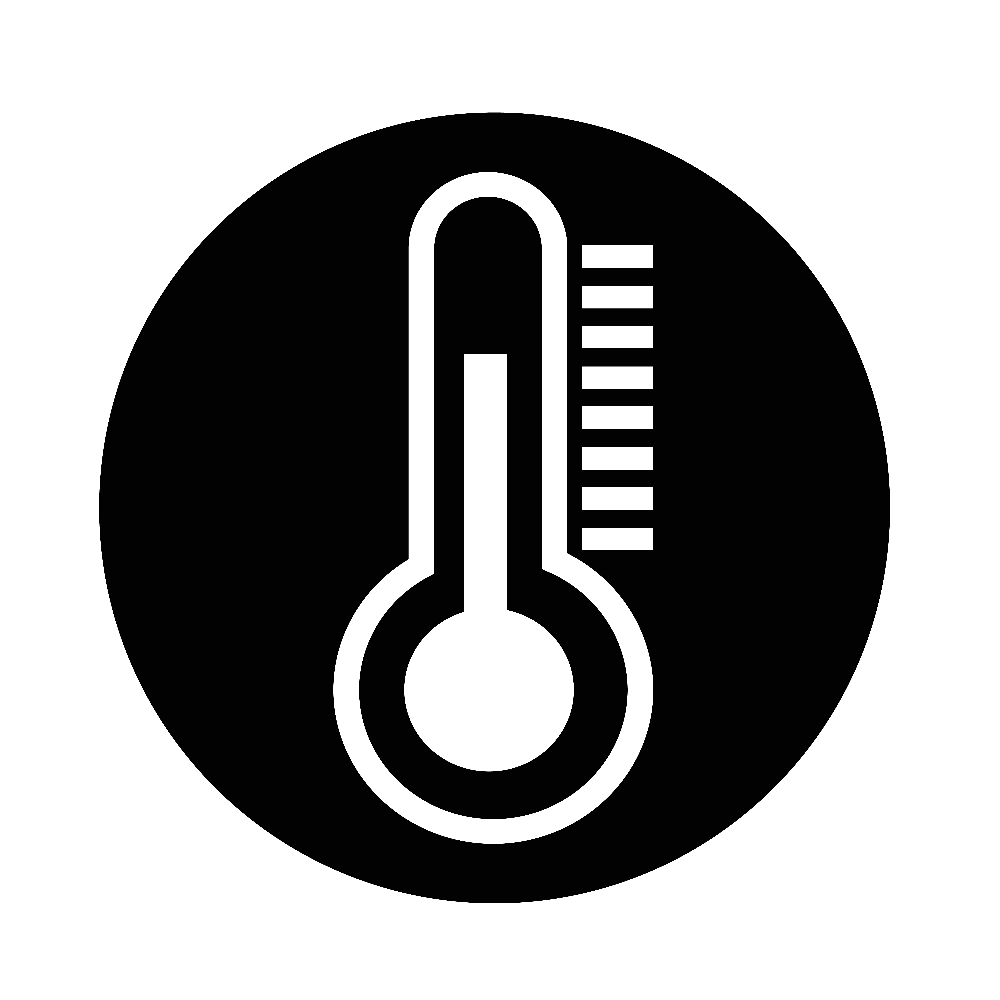
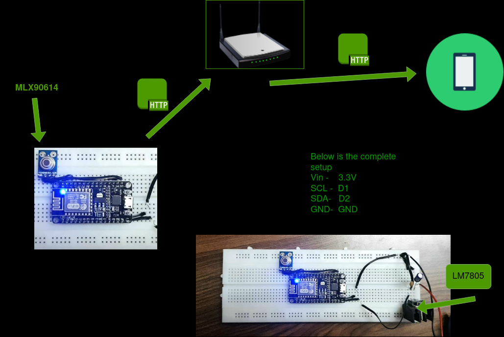
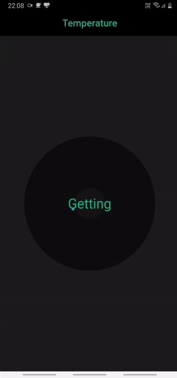

<!--
*** Thanks for checking out this README Template. If you have a suggestion that would
*** make this better, please fork the Temperature and create a pull request or simply open
*** an issue with the tag "enhancement".
*** Thanks again! Now go create something AMAZING! :D
***
***
***
*** To avoid retyping too much info. Do a search and replace for the following:
*** github_username, Temperature, twitter_handle, shreyasatre16@gmail.com
-->

<!-- PROJECT SHIELDS -->
<!--
*** I'm using markdown "reference style" links for readability.
*** Reference links are enclosed in brackets [ ] instead of parentheses ( ).
*** See the bottom of this document for the declaration of the reference variables
*** for contributors-url, forks-url, etc. This is an optional, concise syntax you may use.
*** https://www.markdownguide.org/basic-syntax/#reference-style-links
-->
[![Contributors][contributors-shield]][contributors-url]
[![Forks][forks-shield]][forks-url]
[![Stargazers][stars-shield]][stars-url]
[![Issues][issues-shield]][issues-url]
[![MIT License][license-shield]][license-url]
[![LinkedIn][linkedin-shield]][linkedin-url]

<!-- PROJECT LOGO -->
<br />
<p align="center">
  <a href="https://github.com/SAtacker/Temperature">
    
  </a>
  <br/>
  <a href="https://www.vecteezy.com/free-vector/icons">Icons Vectors by Vecteezy</a>
  <h3 align="center">Data Relay</h3>
  <p align="center">
    An ESP8266 12-E based crude infrared thermometer with a flutter app to get temperature over your home network or any domain over http requests.
    <br />
    <br />
    <a href="#output">View Demo</a>
    ·
    <a href="https://github.com/SAtacker/Temperature/issues">Report Bug</a>
    ·
    <a href="https://github.com/SAtacker/Temperature/issues">Request Feature</a>
  </p>
</p>

<!-- TABLE OF CONTENTS -->
## Table of Contents

* [About the Project](#about-the-project)
  * [Built With](#built-with)
  * [Process](#process)
* [Getting Started](#getting-started)
* [Output](#output)
* [Roadmap](#roadmap)
* [Contributing](#contributing)
* [License](#license)
* [Contact](#contact)
* [Acknowledgements](#acknowledgements)

```

├── include
│   └── README
├── lib
│   └── README
├── LICENSE
├── platformio.ini
├── README.md
├── src
│   └── main.cpp                                                                    ## Main ESP8266 12E program in Arduino REPL
├── temperature_flutter                                                             ## Flutter App
│   ├── android
│   ├── build
│   ├── ios
│   ├── lib
│   ├── pubspec.lock
│   ├── pubspec.yaml
│   ├── README.md
│   ├── temperature.iml
│   └── test
└── test
    └── README

```

<!-- ABOUT THE PROJECT -->
## About The Project
This project is just for the sake of passing my time during this lockdown and temperature measuring has suddenly gained much importance , so why not try it myself Huh?

<!-- PROCESS -->
## Process
<br />
<p align="center">
  
</p>
<br />

### Built With

* [PlatformIO](https://platformio.org/)
* [Flutter](https://flutter.dev/)
* [C++](https://en.wikipedia.org/wiki/C%2B%2B)

<!-- GETTING STARTED -->
## Getting Started

Make sure you have Platform IO installed

To get a local copy up and running follow these simple steps.

```sh
git clone https://github.com/SAtacker/Temperature
cd Temperature
```
Considering you have VScode

```sh
code .
```
Visit their [docs](https://docs.platformio.org/) for installation and guide.

For the Flutter App 

Go to project root `/temperature_flutter` and execute the following command in console to get the required dependencies: 

```
flutter pub get
flutter packages pub run build_runner watch
```

<!-- OUTPUT -->
## Output
<br />
<p align="center">
  
</p>
<br />

<!-- ROADMAP -->
## Roadmap

See the [open issues](https://github.com/SAtacker/Temperature/issues) for a list of proposed features (and known issues).


<!-- CONTRIBUTING -->
## Contributing

Contributions are what make the open source community such an amazing place to be learn, inspire, and create. Any contributions you make are **greatly appreciated**.

1. Fork the Project
2. Create your Feature Branch (`git checkout -b feature/AmazingFeature`)
3. Commit your Changes        (`git commit -m 'Add some AmazingFeature'`)
4. Push to the Branch         (`git push origin feature/AmazingFeature`)
5. Open a Pull Request

<!-- LICENSE -->
## License

Distributed under the MIT License. See `LICENSE` for more information.

<!-- CONTACT -->
## Contact

Your Name - shreyasatre16@gmail.com

Project Link: [https://github.com/SAtacker/Temperature](https://github.com/SAtacker/Temperature)

<!-- ACKNOWLEDGEMENTS -->
## Acknowledgements

* [Instructables](https://www.instructables.com/Infrared-Sensor-With-ESP8266/)
* [Adafruit](https://github.com/adafruit/Adafruit-MLX90614-Library)

<!-- MARKDOWN LINKS & IMAGES -->
<!-- https://www.markdownguide.org/basic-syntax/#reference-style-links -->
[contributors-shield]: https://img.shields.io/github/contributors/SAtacker/Temperature.svg?style=flat-square
[contributors-url]: https://github.com/SAtacker/Temperature/graphs/contributors
[forks-shield]: https://img.shields.io/github/forks/SAtacker/Temperature.svg?style=flat-square
[forks-url]: https://github.com/SAtacker/Temperature/network/members
[stars-shield]: https://img.shields.io/github/stars/SAtacker/Temperature.svg?style=flat-square
[stars-url]: https://github.com/SAtacker/Temperature/stargazers
[issues-shield]: https://img.shields.io/github/issues/SAtacker/Temperature.svg?style=flat-square
[issues-url]: https://github.com/SAtacker/Temperature/issues
[license-shield]: https://img.shields.io/github/license/SAtacker/Temperature.svg?style=flat-square
[license-url]: https://github.com/SAtacker/Temperature/blob/master/LICENSE.txt
[linkedin-shield]: https://img.shields.io/badge/-LinkedIn-black.svg?style=flat-square&logo=linkedin&colorB=555
[linkedin-url]: https://linkedin.com/in/atreshreyas
[product-screenshot]: images/screenshot.png
